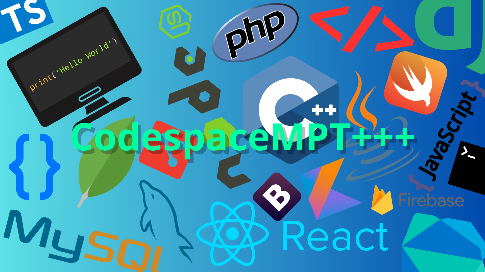

# CodespaceMPT

Comprehensive Development Platform

CodespaceMPT is a platform that allows you to create and manage repositories, databases, and development projects easily and efficiently.

## Features

- Creation of repositories and databases
- Editing and management of repositories and databases
- Saving repositories as .zip files
- Login with Google, GitHub, or email and password
- File upload with drag and drop system

## Why Choose CodespaceMPT?

- Ease of use and intuitive navigation
- Integration with popular development services
- Flexibility and customization to suit your needs

## Get Started

- Sign up now and start creating your projects
- Explore the features and benefits of CodespaceMPT

